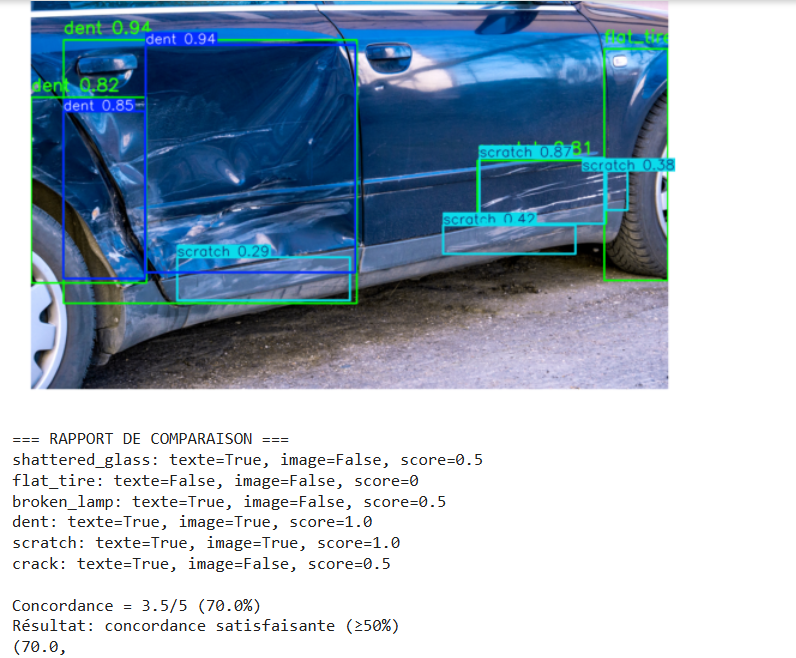

# Accident-Report-AI 🚗🤖  

AI-powered tool for insurance accident reports that:  
- Extracts text from PDFs.  
- Detects vehicle damages in uploaded images (scratches, dents, broken lamps, etc.).  
- Compares results and generates a final matching score with comments.  
- Supports **multiple languages** (English, French, Arabic, …).  

---

## 📸 Demo Screenshot  

  

---

## ⚙️ Features  

- **PDF Text Extraction** → Extract structured accident report data.  
- **Damage Detection** → YOLO-based AI model for detecting car damages.  
- **Comparison Engine** → Matches detected damages with PDF declarations.  
- **Multi-Language Support** → Expands usage to global insurance markets.  

---

## 🚀 Tech Stack  

- **Python**  
- **YOLO (Ultralytics)** for object detection  
- **OpenCV** & **Pillow** for image processing  
- **pdfplumber** for PDF parsing  
- **Deep-Translator** for multi-language support  
---

## 🛠️ Installation  

```bash
# Clone the repository
git clone https://github.com/YourUsername/Accident-Report-AI.git

# Navigate to project folder
cd Accident-Report-AI

# Install dependencies
pip install -r requirements.txt

```
▶️ Usage 
# Run the main script
python app.py
Upload your accident report PDF.

Upload vehicle damage images.

Get a final matching score + AI-generated comment
📄 License

This project is licensed under the MIT License – free to use and modify.

🤝 Contribution

Pull requests are welcome! For major changes, please open an issue first to discuss.

🌍 About

This project is designed for insurance accident report automation.
It was initially developed during a hackathon project and continues to evolve with new AI-powered features.


